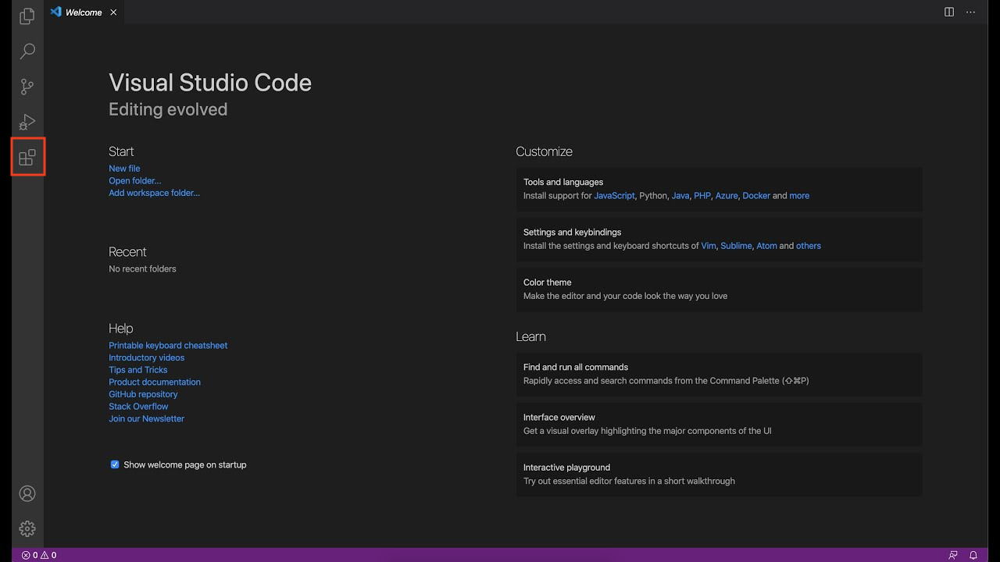
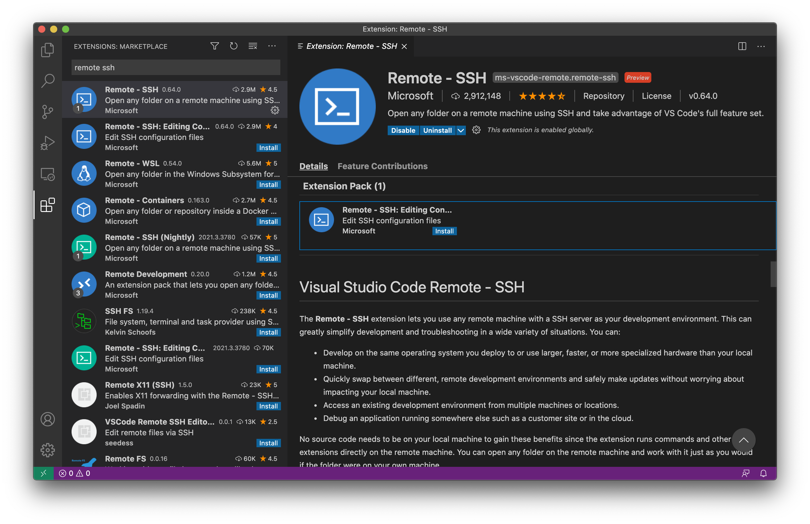
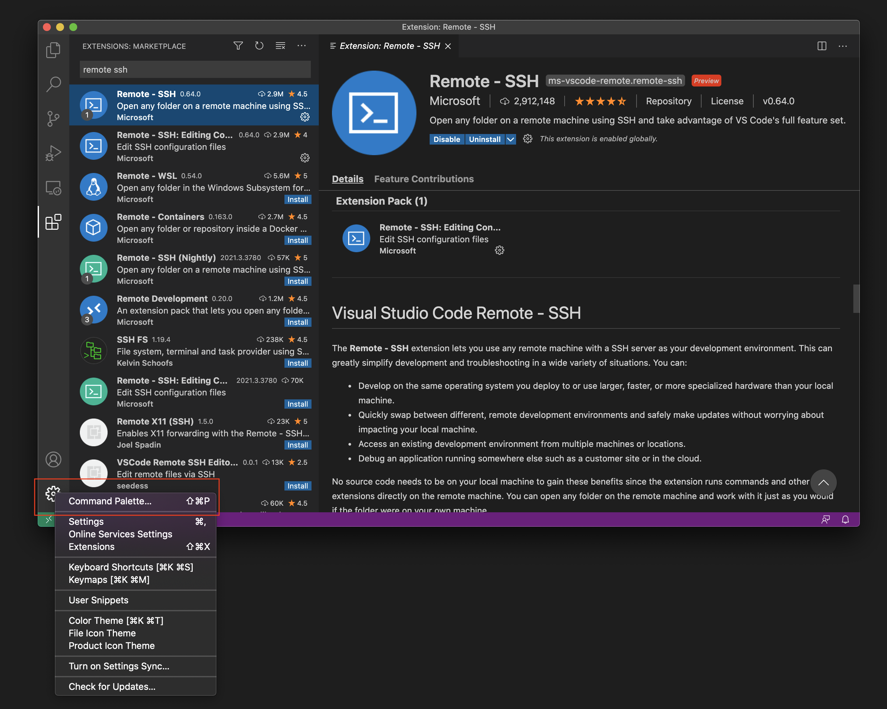
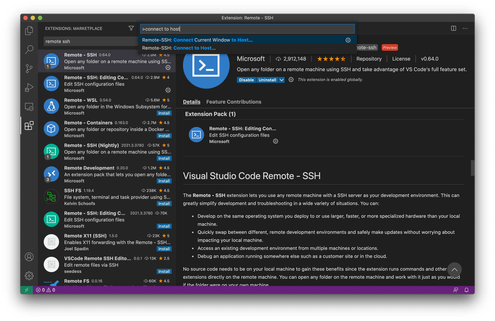
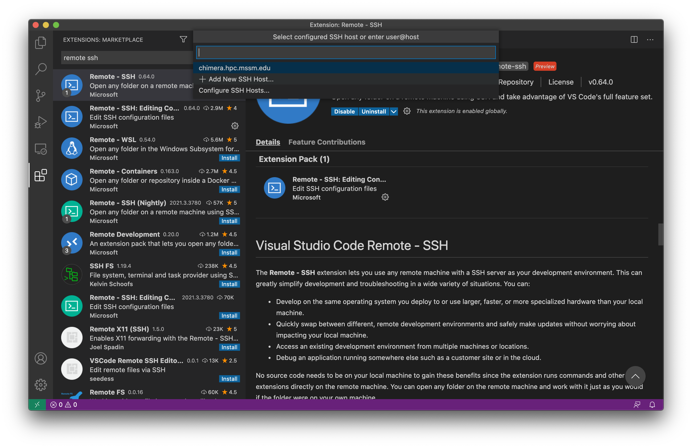
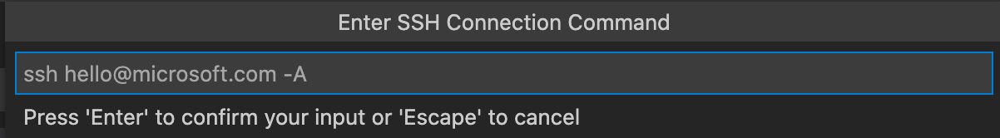

# GDS JC 04/03 - Interactive Demo
The tutorial will cover the following points:
1. Access Minerva using Visual Studio Code (https://code.visualstudio.com/)
2. Clone a sample GitHub repository to your directory (https://github.com/denis-torre/gds-jc-demo)
3. Run a sample RNA-Seq pipeline built using ruffus (https://cgat-ruffus.readthedocs.io/en/latest/)

## Part 1. Access Minerva using Visual Studio Code
1. Download Visual Studio Code at https://code.visualstudio.com/Download
2. Open Visual Studio Code and access the "Extensions" tab on the left

3. Install the Remote SSH extension (also available at https://marketplace.visualstudio.com/items?itemName=ms-vscode-remote.remote-ssh)

4. Open the Manage tab (click on the gear at the bottom left) and select "Command Palette"

5. Search "Connect to Host" and select the option (either will work)

6. If "chimera.hpc.mssm.edu" or "minerva.hpc.mssm.edu" are available, select either one (whichever you normally use - they are stored in your local ssh config).

If these are not available, select "Add New SSH Host..." and enter your ssh command below (e.g. `ssh YOUR_USERNAME@hpc.mssm.edu`):

7. Enter your password followed by your VIP code, as with logging in via Terminal.

