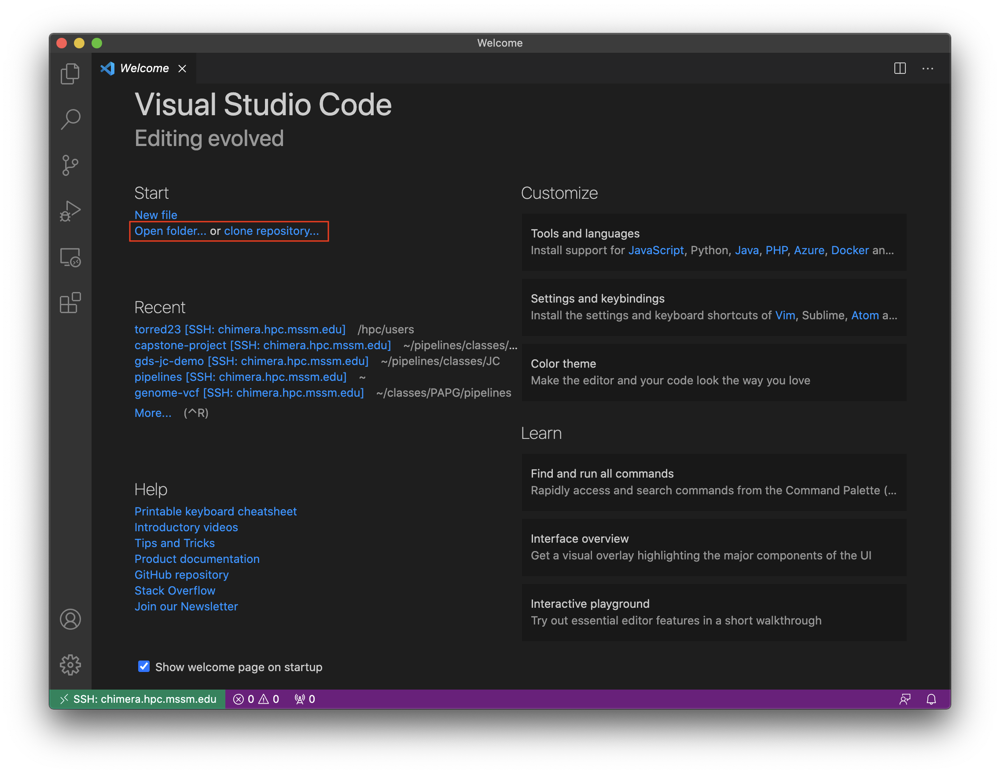
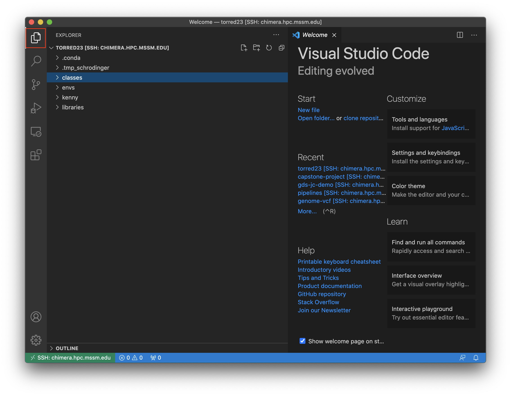
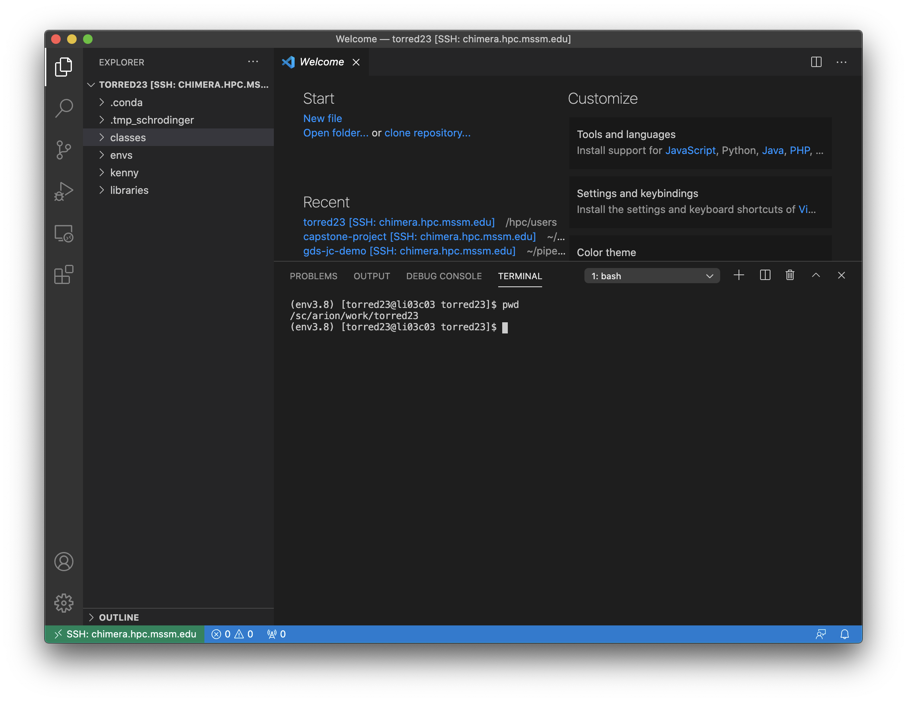

# GDS JC 04/03 - Interactive Demo
The tutorial consists of the following steps:
1. Access Minerva using Visual Studio Code (https://code.visualstudio.com/)
2. Clone a sample GitHub repository to your directory (https://github.com/denis-torre/gds-jc-demo)
3. Run a sample RNA-Seq pipeline built using ruffus (https://cgat-ruffus.readthedocs.io/en/latest/)

## Part 1. Access Minerva using Visual Studio Code
1. Download Visual Studio Code at https://code.visualstudio.com/Download
2. Open Visual Studio Code and access the "Extensions" tab on the left

3. Install the Remote SSH extension (also available at https://marketplace.visualstudio.com/items?itemName=ms-vscode-remote.remote-ssh)

4. Open the Manage tab (click on the gear at the bottom left) and select "Command Palette"

5. Search "Connect to Host" and select either option (use current or new window)

6. If "chimera.hpc.mssm.edu" or "minerva.hpc.mssm.edu" are available, select either one (whichever you normally use - they are stored in your local ssh config).

If these are not available, select "Add New SSH Host..." and enter the ssh command as you would using Terminal (e.g. `ssh YOUR_USERNAME@chimera.hpc.mssm.edu`):

Enter your password followed by your VIP code, as with logging in via Terminal.

7. You are now connected to Minerva through SSH. To better interact with the filesystem, click on "Open folder..." to open a desired directory (e.g. your work folder `/sc/arion/work/YOUR_USERNAME`).

8. You can now interact with the file system using the File Explorer on the left.

9. Finally, select View > Open Terminal from the top menu. The terminal is connected to Minerva and can be used to run code, load modules, etc.

